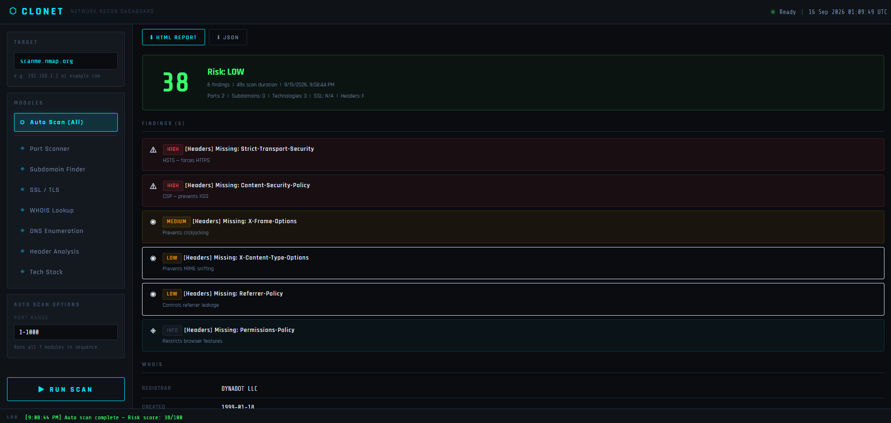

# ⬡ CLONET
**Network Recon Dashboard for External Penetration Testing**

Built by CLONE | Python · Flask · Vanilla JS

CLONET is a lightweight, self-hosted recon dashboard that automates early-stage external penetration testing tasks.




## Modules
| Module | What it does |
|--------|-------------|
| Port Scanner | Wraps nmap — scans ports, detects services, flags risky ones |
| Subdomain Finder | DNS brute-force — finds live subdomains, flags interesting ones |
| WHOIS Lookup | Registration info, registrar, nameservers |
| DNS Enumeration | Auto-pulls A, MX, NS, TXT, SOA, CAA, SRV — analyzes SPF/DMARC |
| Header Analysis | Grades HTTP security headers, flags version disclosure |
| Tech Stack | Fingerprints server, CMS, frameworks, CDN, cloud provider |

## Installation
```bash
git clone https://github.com/YOUR_HANDLE/clonet.git
cd clonet
python -m venv venv && source venv/bin/activate  # Windows: venv\Scripts\activate
pip install -r requirements.txt
python app.py
```
Open http://localhost:5000

Requires: Python 3.10+ and nmap installed (https://nmap.org)

## Legal
Only use against targets you have explicit written authorization to test.

*CPTS study project — HTB Academy path*
